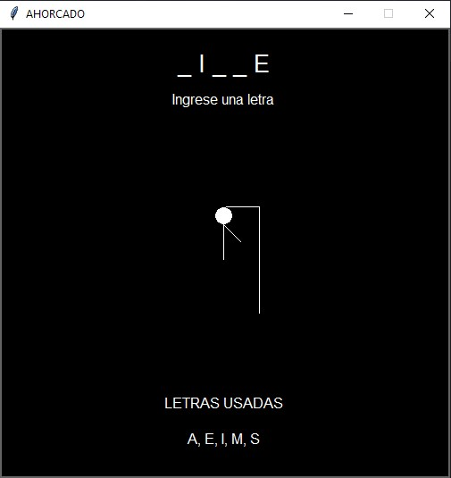
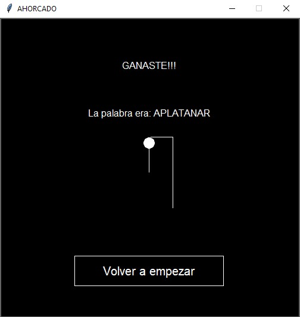
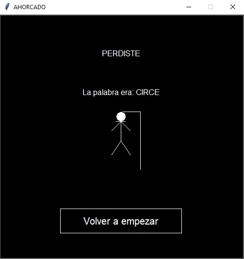

# Hangman Game 🏴‍☠️

Welcome to **Hangman**, a classic word-guessing game where players try to guess a hidden word by suggesting letters within a limited number of attempts. This project is an implementation of the Hangman game in Python, utilizing structured programming principles.

## 📜 Table of Contents

- [Features](#features)
- [Installation](#installation)
- [Usage](#usage)
- [Images](#images)
- [File Structure](#file-structure)
- [Technologies](#technologies)
- [Contributing](#contributing)
- [License](#license)
- [About This Project](#about)

## 🕹️ Features <a name="features"></a>

- Classic Hangman gameplay with word guessing
- Limited attempts to guess the word
- Random word selection from a predefined list
- Intuitive graphical interface with keyboard controls

## 🚀 Installation <a name="installation"></a>

To run this project locally, follow these steps:

1. Clone the repository:
   ```bash
   git clone https://github.com/SebaB29/hangman.git
   ```

2. Navigate to the project directory:
   ```bash
   cd hangman
   ```

3. Run the game:
   ```bash
   python main.py
   ```

## 🎮 Usage <a name="usage"></a>

To play the game, type a letter into the input field and press Enter. You have a limited number of incorrect guesses before the game is over. The goal is to guess the hidden word before running out of attempts.

## 📷 Images <a name="images"></a>

<div style="display: flex;">
    
    
    
</div>

## 📁 File Structure <a name="file-structure"></a>

The project structure is as follows:

```
Hangman/
├── graphics/
│   ├── gamelib.py
│   └── inter_gráfica.py
├── img/
│   └── [3 demo images of the game]
├── resource/
│   └── palabras.py
├── src/
│   ├── ahoracado.py
│   └── letra.py
├── main.py
├── LICENSE
├── README.md
└── .gitignore
```

- **graphics/**: Contains libraries for rendering the game (gamelib and graphical logic).
- **img/**: Includes demo images showcasing the game's functionality.
- **resource/**: Contains a file with a list of words (`palabras.py`) that can be used in the game.
- **src/**: Contains the source code files for game logic (ahoracado and letter handling).
- **main.py**: The entry point of the application.

## 🛠️ Technologies <a name="technologies"></a>

This project is built with:

- Python
- [Gamelib](https://github.com/dessaya/python-gamelib) (A library created by the instructor to facilitate the use of threads and rendering for the interface)

## 🤝 Contributing <a name="contributing"></a>

Contributions are welcome! If you'd like to improve the game, feel free to fork the repository and submit a pull request.

1. Fork the repository
2. Create your feature branch (`git checkout -b feature/AmazingFeature`)
3. Commit your changes (`git commit -m 'Add some AmazingFeature'`)
4. Push to the branch (`git push origin feature/AmazingFeature`)
5. Open a pull request

## 📄 License <a name="license"></a>

Distributed under the MIT License. See `LICENSE` for more information.

## 📚 About This Project <a name="about"></a>

This project is an implementation of the classic Hangman game in Python, focusing on game logic and graphical interface through structured programming principles.
